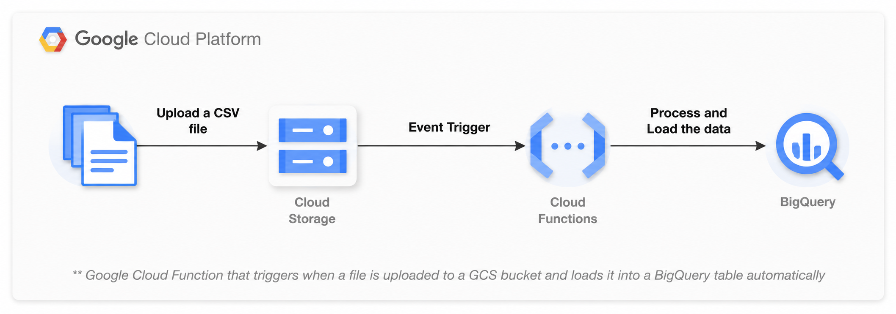

## Event driven file processing using Cloud function, GCS and BigQuery

This project deploys a Google Cloud Function that triggers when a file is uploaded to a GCS bucket and loads it into a BigQuery table automatically.

### ✅ Use Case

Whenever a new `.csv` file is uploaded to the specified GCS bucket, this function:
1. Gets triggered by the GCS **finalize event**
2. Reads the CSV file
3. Loads the content directly into a BigQuery table (with autodetect schema)